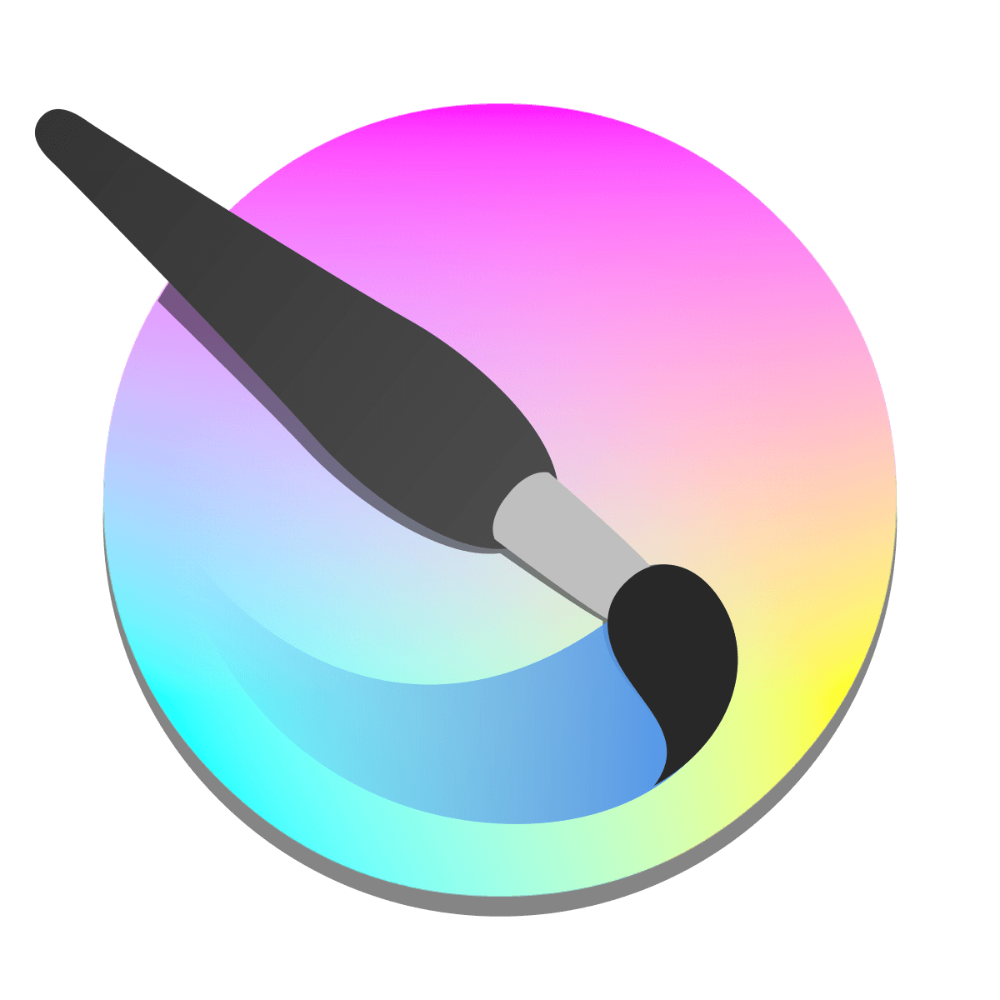
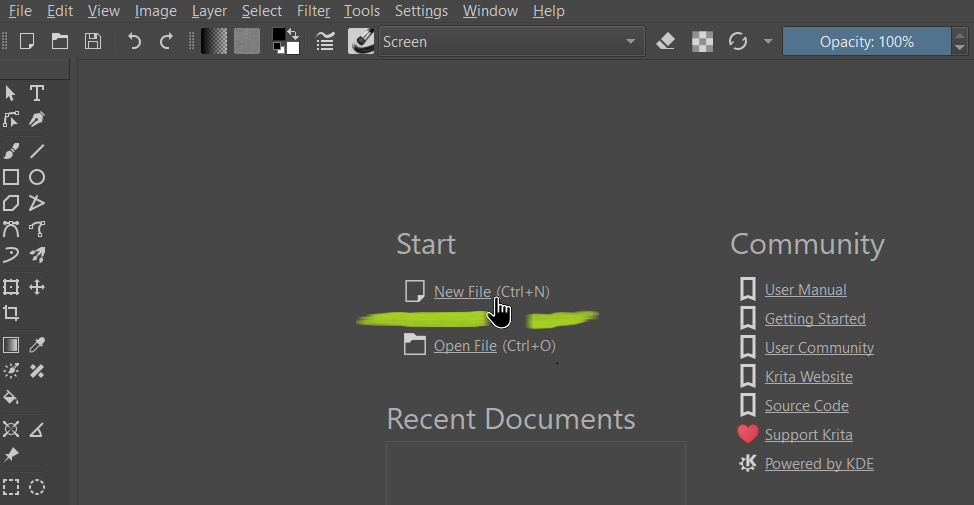
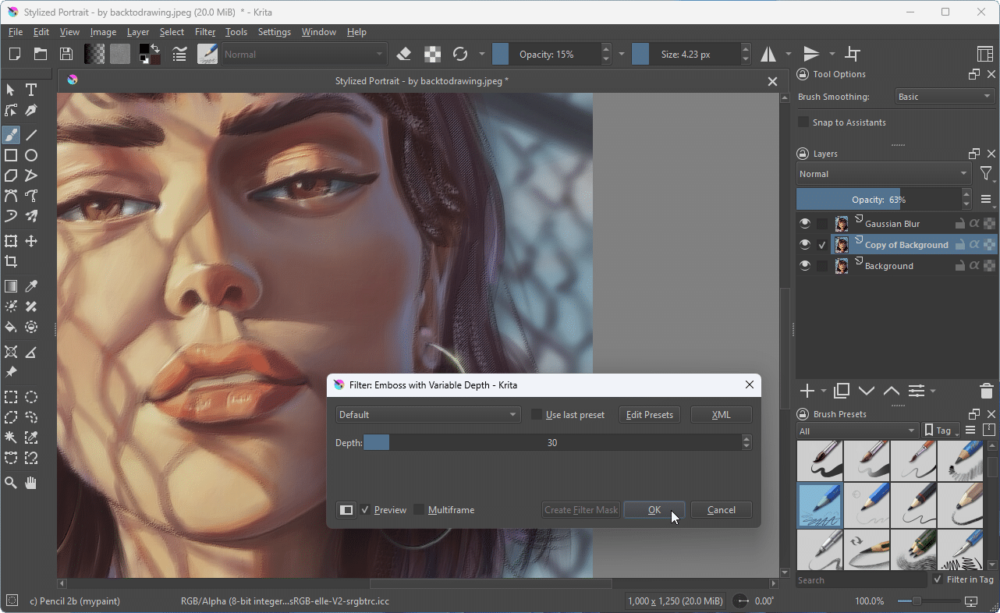
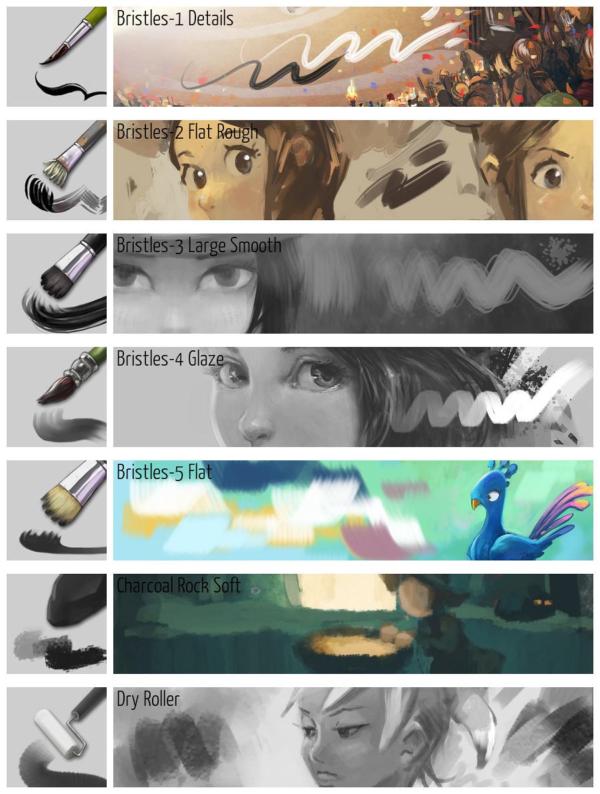
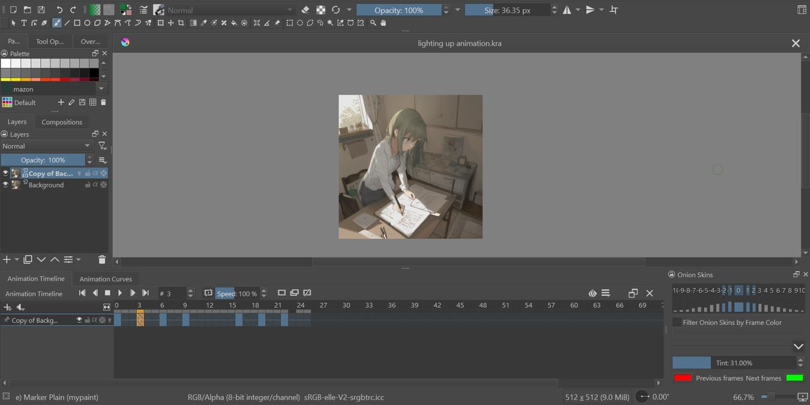

# Krita

Nera Grgic
Informacijske tehnologije

---

## Glavne značajke Krite

**Krita** je moćan besplatan program za digitalno crtanje i slikanje, popularan među umjetnicima i ilustratorima. Evo glavnih značajki koje ga čine posebnim:

---

## 1. Podrška za crtanje i slikanje

- Različiti alati za slikanje (četke, olovke, markeri, teksture).
- Realistični efekti, poput akvarela, ulja, krede i mnogih drugih.
- Mogućnost prilagodbe i stvaranja vlastitih četki.

---

## 2. Napredni alati za rad s slojevima

- Podrška za slojeve i grupe slojeva.
- Različiti načini miješanja boja i efekata.
- Mogućnost rada s maskama slojeva.

---

## 3. Jednostavno korisničko sučelje

- Intuitivan raspored alata i prozora.
- Docker sustav koji omogućava prilagodbu radnog prostora.

---

## 4. Podrška za grafičke tablete

- Kompatibilnost s različitim markama i modelima tableta.

## 5. Otvoreni izvor i zajednica

- Potpuno besplatan i otvorenog koda.

---

Krita je idealan alat za digitalne umjetnike koji traže fleksibilnost i kvalitetu bez troškova.

---

Krita je besplatna i open-source aplikacija za digitalno crtanje, slikanje i uređivanje grafike, dizajnirana za umetnike i profesionalce koji rade sa 2D vizuelnim sadržajem. Krita je dostupna za Windows, macOS i Linux.

---

## Pocetak

Kada prvi put pokrenete Kritu, dočekat će vas početni zaslon s opcijama za stvaranje nove datoteke ili otvaranje postojećeg dokumenta. Da biste stvorili novo platno, morate kreirati novi dokument iz izbornika Datoteka ili kliknuti na Nova datoteka u odjeljku za početak na početnom zaslonu.

---

---

Iako se Krita primarno smatra aplikacijom koja radi s raster grafikom, posjeduje i određene mogućnosti uređivanja vektorske grafike. Ako ste novi u digitalnom slikanju, važno je najprije upoznati se s osnovnim pojmovima raster i vektorske grafike.

---

---

### Dockeri

Dockeri su mali podprozori u sučelju programa Krita. Oni sadrže korisne alate, poput birača boja, popisa slojeva, opcija alata i slično.

---

### Cetke

U Kriti, četke su jedan od najvažnijih alata za digitalno crtanje i slikanje. Program nudi širok spektar četki koje oponašaju stvarne medije poput olovke, tinte, akvarela, ulja i mnogih drugih.

---

---

### Animiranje

Animiranje u Kriti nudi moćne alate za stvaranje 2D animacija, čineći ga idealnim za umjetnike koji žele dodati kretanje svojim digitalnim crtežima.

---

